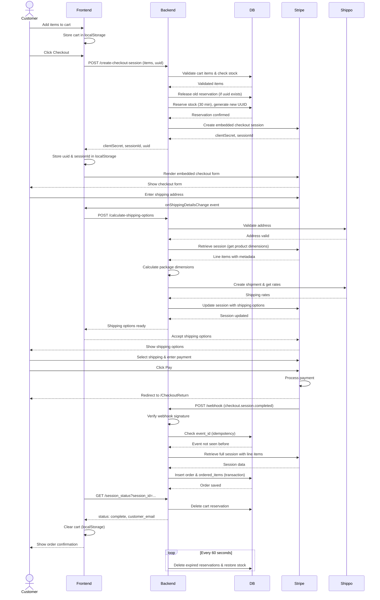

# Checkout Sequence Diagram

```mermaid
sequenceDiagram
    actor Customer
    participant Frontend
    participant Backend
    participant DB
    participant Stripe
    participant Shippo

    Customer->>Frontend: Add items to cart
    Frontend->>Frontend: Store cart in localStorage

    Customer->>Frontend: Click Checkout
    Frontend->>Backend: POST /create-checkout-session (items, uuid)

    Backend->>DB: Validate cart items & check stock
    DB-->>Backend: Validated items

    Backend->>DB: Release old reservation (if uuid exists)
    Backend->>DB: Reserve stock (30 min), generate new UUID
    DB-->>Backend: Reservation confirmed

    Backend->>Stripe: Create embedded checkout session
    Stripe-->>Backend: clientSecret, sessionId
    Backend-->>Frontend: clientSecret, sessionId, uuid

    Frontend->>Frontend: Store uuid & sessionId in localStorage
    Frontend->>Stripe: Render embedded checkout form
    Stripe-->>Customer: Show checkout form

    Customer->>Stripe: Enter shipping address
    Stripe->>Frontend: onShippingDetailsChange event
    Frontend->>Backend: POST /calculate-shipping-options

    Backend->>Shippo: Validate address
    Shippo-->>Backend: Address valid

    Backend->>Stripe: Retrieve session (get product dimensions)
    Stripe-->>Backend: Line items with metadata

    Backend->>Backend: Calculate package dimensions
    Backend->>Shippo: Create shipment & get rates
    Shippo-->>Backend: Shipping rates

    Backend->>Stripe: Update session with shipping options
    Stripe-->>Backend: Session updated
    Backend-->>Frontend: Shipping options ready
    Frontend-->>Stripe: Accept shipping options
    Stripe-->>Customer: Show shipping options

    Customer->>Stripe: Select shipping & enter payment
    Customer->>Stripe: Click Pay
    Stripe->>Stripe: Process payment

    Stripe-->>Customer: Redirect to /CheckoutReturn
    Stripe->>Backend: POST /webhook (checkout.session.completed)

    Backend->>Backend: Verify webhook signature
    Backend->>DB: Check event_id (idempotency)
    DB-->>Backend: Event not seen before

    Backend->>Stripe: Retrieve full session with line items
    Stripe-->>Backend: Session data

    Backend->>DB: Insert order & ordered_items (transaction)
    DB-->>Backend: Order saved

    Frontend->>Backend: GET /session_status?session_id=...
    Backend->>DB: Delete cart reservation
    Backend-->>Frontend: status: complete, customer_email

    Frontend->>Frontend: Clear cart (localStorage)
    Frontend-->>Customer: Show order confirmation

    loop Every 60 seconds
        Backend->>DB: Delete expired reservations & restore stock
    end
```
