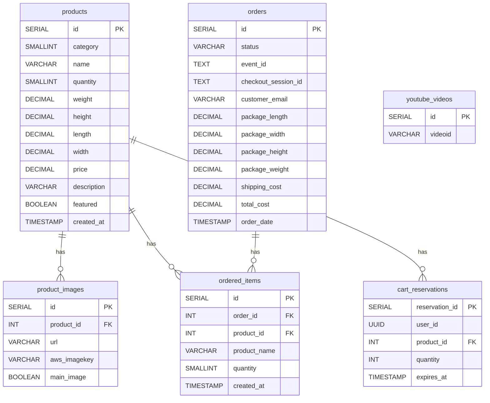

# Database Diagram — ecommerce_db

```mermaid
erDiagram
    products {
        SERIAL id PK
        SMALLINT category
        VARCHAR name
        SMALLINT quantity
        DECIMAL weight
        DECIMAL height
        DECIMAL length
        DECIMAL width
        DECIMAL price
        VARCHAR description
        BOOLEAN featured
        TIMESTAMP created_at
    }

    product_images {
        SERIAL id PK
        INT product_id FK
        VARCHAR url
        VARCHAR aws_imagekey
        BOOLEAN main_image
    }

    orders {
        SERIAL id PK
        VARCHAR status
        TEXT event_id
        TEXT checkout_session_id
        VARCHAR customer_email
        DECIMAL package_length
        DECIMAL package_width
        DECIMAL package_height
        DECIMAL package_weight
        DECIMAL shipping_cost
        DECIMAL total_cost
        TIMESTAMP order_date
    }

    ordered_items {
        SERIAL id PK
        INT order_id FK
        INT product_id FK
        VARCHAR product_name
        SMALLINT quantity
        TIMESTAMP created_at
    }

    cart_reservations {
        SERIAL reservation_id PK
        UUID user_id
        INT product_id FK
        INT quantity
        TIMESTAMP expires_at
    }

    youtube_videos {
        SERIAL id PK
        VARCHAR videoid
    }

    products ||--o{ product_images : "has"
    products ||--o{ ordered_items : "has"
    products ||--o{ cart_reservations : "has"
    orders ||--o{ ordered_items : "has"
```
