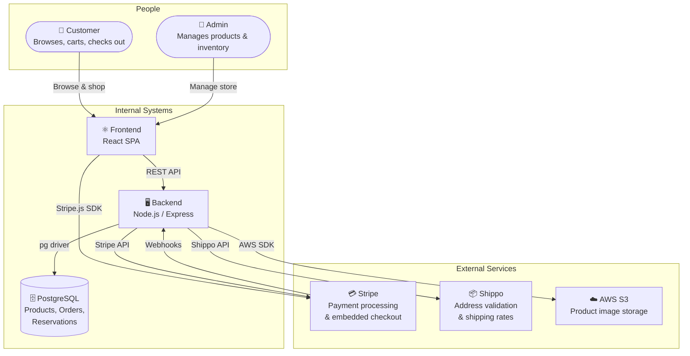

# System Context Diagram

```mermaid
flowchart TB
    subgraph People
        Customer(["👤 Customer\nBrowses, carts, checks out"])
        Admin(["👤 Admin\nManages products & inventory"])
    end

    subgraph Internal Systems
        Frontend["⚛️ Frontend\nReact SPA"]
        Backend["🖥️ Backend\nNode.js / Express"]
        DB[("🗄️ PostgreSQL\nProducts, Orders,\nReservations")]
    end

    subgraph External Services
        Stripe["💳 Stripe\nPayment processing\n& embedded checkout"]
        Shippo["📦 Shippo\nAddress validation\n& shipping rates"]
        AWS["☁️ AWS S3\nProduct image storage"]
    end

    Customer -->|"Browse & shop"| Frontend
    Admin -->|"Manage store"| Frontend

    Frontend -->|"REST API"| Backend
    Frontend -->|"Stripe.js SDK"| Stripe

    Backend -->|"pg driver"| DB
    Backend -->|"Stripe API"| Stripe
    Backend -->|"Shippo API"| Shippo
    Backend -->|"AWS SDK"| AWS

    Stripe -->|"Webhooks"| Backend
```
